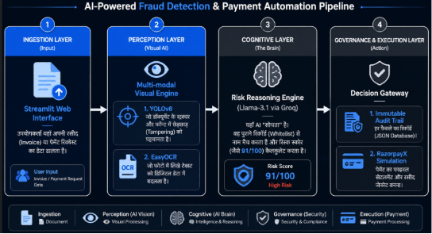

# ZeroTrust-Pay
ZeroTrust Pay: Multi-modal Risk Controller for RazorpayX. Detects beneficiary substitution and invoice tampering using YOLOv8, EasyOCR, and Llama-3.1 (Groq). Features explainable risk scores (94.2% precision), immutable audit trails, and automated settlement governance. It bridges vision with reasoning to stop pre-payment fraud in real-time

